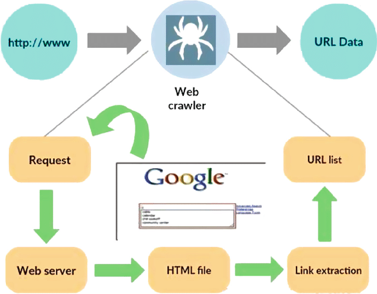

# Web Creator - Serving - Crawling Service
<p align="center">
  
</p>
<br />Implementation of Simple Webpage Creator, Server and Client. At first the WebCreator, using a textfile, takes random lines of it and creates a number of sites containing pages. Each site has links to pages of the same site and of different sites. The output of the WebCreator is provided to WebServer, which using threads, can serve the pages to clients. WebCrawler starting from a specific page, repeatively requests from server and looks for links inside of it and keeps requesting the corresponding page. When WebCrawler collects all available pages, it can execute search queries using the jobExecutor System from https://github.com/AndCharalampous/jobexecutor.

## Deployment

The code was developed and tested on **Linux Ubuntu 16.04 LTS** using **gcc v5.4.0**.

## Prerequisites

A Linux distribution is required with a gcc compiler order to compile and execute. _gcc v5.4.0_ or older is recommended.
<br />You can check your gcc compiler version using:
<br />``` $ gcc --version ```

You can install the latest gcc compiler on Ubuntu based systems using:
<br />``` $ sudo apt install build-essential ``` 

## Getting Started
Download Repository Locally using:
<br /> ```$ git clone https://github.com/AndCharalampous/web-server-crawler.git ```

## Compilation
* WebServer: Compile code guiding in src/WebServer directory and using the Makefile:
<br /> ```$ cd src/WebServer```
<br /> ```$ make```
<br /> Executable file myhttpd is created.
* WebCrawler: Compile code guiding in src/WebCrawler directory and using the Makefile:
<br /> ```$ cd src/WebCrawler```
<br /> ```$ make```
<br /> Executable file mycrawler is created.

### Execution
* WebCreator: Execute using:
<br /> ```$ bash webcreator.sh rootDir docName numSites numPages```
<br />dirName: Name of directory which sites and pages will be stored. **Must Exist before Execution**
<br />docName: Name of file containing text
<br />numSites: Number of sites to be created
<br />numPages: Number of pages per site to be created
* WebServer: Execute using:
<br /> ```$ ./myhttpd -p servingPort -c commandPort -t numThreads -d rootDir```
<br />servingPort: Port to which server listens to serve pages
<br />commandPort: Port to which server listens to recieve commands
<br />numThreads: Number of threads in threadpool of server
<br />rootDir: Path to directory containing sites from webCreator
* WebCrawler: Execute using:
<br /> ```$ ./mycrawler -h hostIP -p port -c commandPort -t numThreads -d saveDir startingURL```
<br />hostIP: Name or IP of machine running WebServer
<br />port: Port that the WebServer listens to
<br />commandPort: Port to which crawler listens to recieve commands
<br />numThreads: Number of threads in threadpool of crawler
<br />saveDir: Path to directory in which the requested pages will be stored
<br />startingURL: First page requested

### Commands
* WebServer:
  * STATS: Server replies with the time running, number of pages served and total bytes.
  * SHUTDOWN: Server stop accepting more requests and shuts down.
* WebCrawler:
  * STATS: Crawler replies with the time running, number of pages downloaded and total bytes
  * SEARCH word1 word2 word3 ... word10: Crawler creates Workers for executing search queries and sending results through sockets.
  SHUTDOWN: Crawler stop requesting more pages and shuts down.

## Author

**Andreas Charalampous** - https://github.com/AndCharalampous

## License

This project is licensed under the MIT License - see the [LICENSE.md](LICENSE.md) file for details
